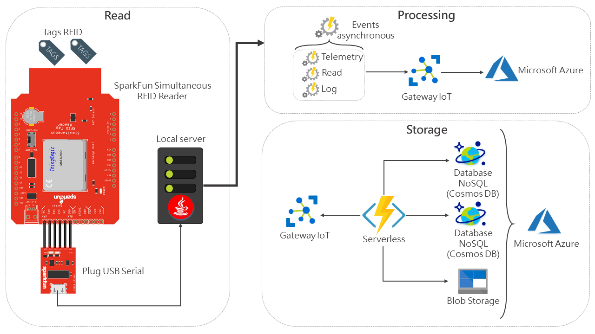
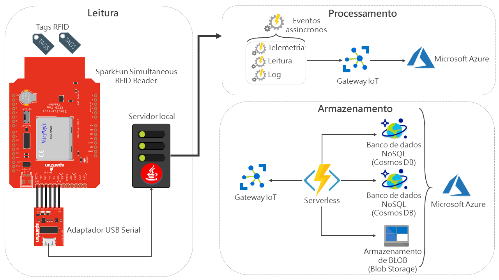

# IoT Middleware RFID Tag Reading

IoT Middleware RFID Tag Reading, implemented in the year 2019 for Master's Work.

## Project architecture

This repository provides the implementation of IoT middleware. For serverless service implementation (Azure Functions), see the application [repository](https://github.com/yagoluiz/rfid-reader-api).

## Master's work

See the work [repository](https://github.com/yagoluiz/unb-dissertacao) for more details of the project.

## Technologies

- Java 8
- [Azure IoT Hub](https://azure.microsoft.com/en-us/services/iot-hub/)
- [SDK Mercury API](https://www.jadaktech.com/documentation/rfid/mercuryapi/)

## Instructions for run project

- Run project in Java IDE preferably

# [PT-BR] Middleware IoT de Leitura de Tags RFID

Middleware IoT de Leitura de Tags RFID, implementado no ano de 2019 para trabalho de Mestrado.

## Arquitetura do projeto

Este repositório apresenta a implementação do middleware IoT. Para implementação do serviço serverless (Azure Functions), consulte o [repositório](https://github.com/yagoluiz/rfid-reader-api) da aplicação.

## Trabalho de Mestrado

Consulte o [repositório](https://github.com/yagoluiz/unb-dissertacao) do trabalho para mais detalhes do projeto.

## Tecnologias

- Java 8
- [Azure IoT Hub](https://azure.microsoft.com/en-us/services/iot-hub/)
- [SDK Mercury API](https://www.jadaktech.com/documentation/rfid/mercuryapi/)

## Instruções para execução do projeto

- Executar projeto na IDE Java de preferência